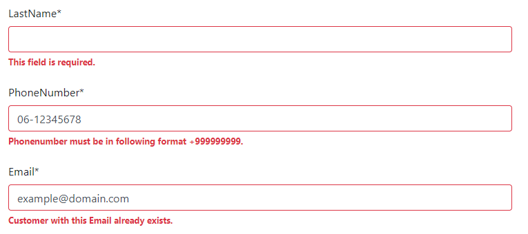

# Django Form Assignment
Python3 Django Form Assignment. See "Python Assignment.pdf" for details.

## FIRST RUN
```
pip install -r requirements.txt
python manage.py migrate
```

## RUN
```
python manage.py runserver
```

## FORMS
http://localhost:8000/customer/ <br>
http://localhost:8000/shipping/

## API
http://localhost:8000/api/ <br>
http://localhost:8000/api/customer/ <br>
http://localhost:8000/api/shipping/

## FORM VALIDATION
